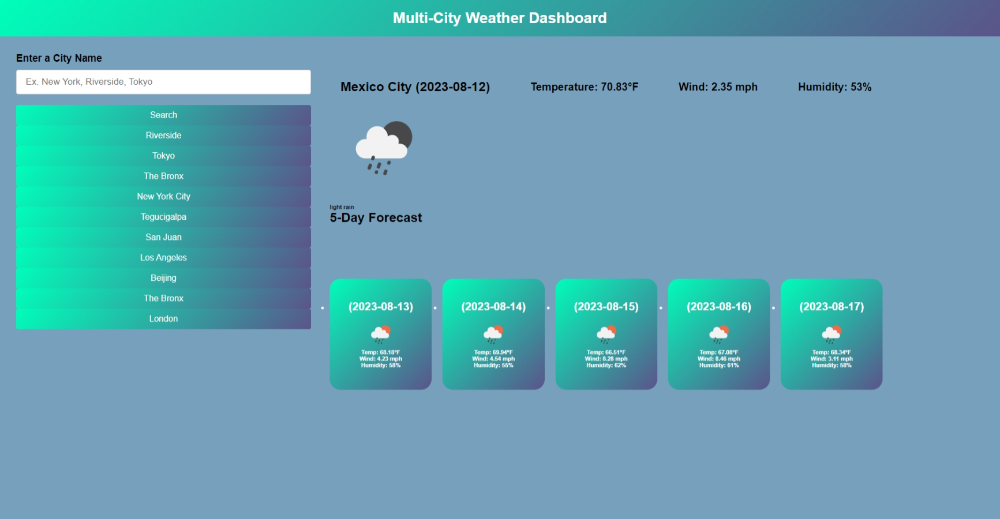

# Multi-City-Weather-Dashboard
Created a multi city weather app that give you the current weather and a five-day forecast. It provides the current tempature wind speed and humidity. It also generates an icon for the current weather condition. The five-day forecast also provides icons based on the weather displayed. I used a gradient for the styling. Units used are set to imperial measurements. 

# Screenshot Of Website

# Link to Git Hub
https://github.com/1014jorge/Multi-City-Weather-Dashboard

# BUGS
all cities typed in save to local storage but to search previous cities searched, you must refresh web page and the buttons pop under search button. search funtionality of previous searches still work.
